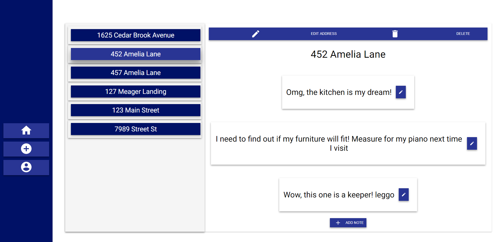
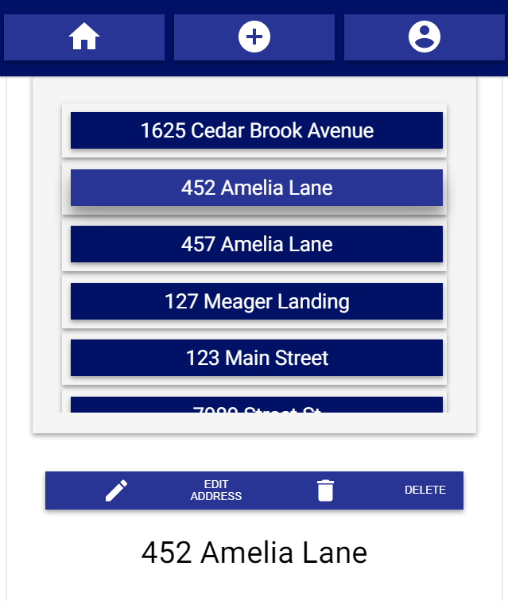

# Homebl - Server

Simple create, read, update, and delete utility application for homeshoppers

## Live Application

---

### [Homebl](https://homebl.vercel.app/)

--- Vercel App

## The Problem

---

As a homebuyer, you search a bizzilion websites, like Zillow, Redfin, etc., finding your favorite homes, only to mismanage and lose the list. You want a place to store all your favorite homes that you lose during the countless hours you spend browsing the real estate web. You want to be able to save a simple note, with the address and other useful information. You want to be able to save these homes as a list for future use, to edit and delete as needed.

## The Solution

---

`Homebl` is a very lightweight, simple solution for saving home addresses and notes in one central place. It will allow the user to save her favorite homes, update, and delete them in a personalized account.

> A great solution for realtors adding value to their customers

## Summary

---

`Homebl` is a react powered, mobile-friendly web application that uses a deployed PostgreSQL powered database, Node.js & Express powered server.

### Capstone

This is a capstone for Thinkful's 'Software Engineering Immersion' program. This is also my FIRST solo full-stack application! The project was completed within a 10 day working day period, not including a week for planning (wireframing, brainstorming, kanban board prep, etc.), therefore the `MVP` version is limited to simple `CRUD` utilities and features a very simple UI. Thinkful's program does not cover basic or advanced use of React Hooks nor was there an emphasis on design. Through my own, I studied some basic examples of React Hooks and common practices and I really enjoyed my time learning, as it made state management much easier to compartmentalize. I also appreciate the flexibility and imagination they give a developer. I have plans for expansion that are listed below under 'Coming Features'.

---

#### Preview Images




### Features

---

- Login and Register
- Logout persists user stored data
- Add an address - Simple format for: mailing address, city, state, zip code
- Add a note for an address - Simple content, user specific
- Edit the fields for the address
- Edit the content of the note
- Delete the address entirely
- Delete a specific address's note(s)

### Technology

---

- Hooks
  - `react@latest` & `react-dom@latest`
  - customHooks!
  - all components are using state from custom hooks
  - example ...

  ```javascript
  const useGetAddress = ({match}) => {
  const [address, setAddress] = useState({})
  const [addressError, setError] = useState(null)
  const { addressId } = match.params
  useEffect(() => {
    let mounted = true
    const getAddress = async () => {
      try {
        const response = await fetch(
          `${.../address/${addressId}`,...)
        const data = await response.json()
        if (data.error) throw data.error

        mounted && setAddress(data)
      } catch (error) {
        setError(error)
      }
    }
    getAddress()
    return () => (mounted = false)
  }, [addressId])
    return { address, addressError }
  }

- User Authentication
  - fetching and storing `jwt` authorization token from the database, which encrypts user passwords using `bcrypt`

  ```javascript
  function saveAuthToken(token) {
    window.localStorage.setItem(token_key, token)
  }

- Conditional Rendering
  - use state variables to render components
  - user is redirected based on token truthiness

  ```javascript
  <Route
    exact
    path='/'
    render={() =>
      !isLogged ? (
        <Redirect to={'/login'} />
      ) : (
        <Redirect to={'/address'} />
      )
    }
  />

- React Context Api

  ```javascript
    const LoggedInContext = createContext({
    isLogged: false,
    setIsLogged: () => {},
    })

- Express.js powered API backend --- [Server GitHub Repository](https://github.com/themlp101/homebl-server)
  - server supports `/GET /POST /DELETE /PATCH` HTTP requests
  - `bcrypt` password encryption and `jwt` for front-end verification
  - uses `CORS` (Cross-origin resource sharing) standards
  - uses `helmet` for protected HTTP request headers
  - database migration with `postgrator-cli`
  - utilizes `morgan` as logger middleware
  - database queried using `knex` library
  - deployed using `heroku`

### Server Information

#### Address Routes

---
Returns json data about addresses in the database.

  ```javascript
      // 200 'ok' response
      const addresses = [{
        address_1,
        address_2,
        address_3,
        city,
        state,
        zip_code
      }, ...]
  ```

- URL
  - `/address`
  - Methods:
    - `/GET`
    - `/POST`
  - URL Params:
    - None
  - Data Params:
    - `/POST`
      - Request Body: `address [object]`
      - Required Fields: `address_1`, `city`, `state`, and `zip_code`
  - Success Response:
    - `/GET`
      - Code: `200`
    - `/POST`
      - Code: `201 Created`
  - Error Response:
    - `/GET`
      - Code: `401 Unauthorized`
      - Content: `{ error: 'Unauthorized request' }`
    - `/POST`
      - Code: `400 Bad Request`
      - Content : `{ error: 'Missing [key] in request body'}`

  - Example:
  
  ```javascript
  // GET
    const response = await fetch(
      `${config.API_ENDPOINT}/address`,
      {
        method: 'GET',
        headers: {
          'content-type': 'application/json',
          authorization: `bearer token`,
        },
      }
      )
    const data = await response.json()
  ```

  ```javascript
  // POST
    const response = await fetch(
      `${config.API_ENDPOINT}/address`,
      {
        method: 'POST',
        headers: {
          'content-type': 'application/json',
          authorization: `bearer token`,
        },
        body: JSON.stringify(newAddress),
      }
    )
    const data = await response.json()
  ```
  
- URL
  - `/address/:address_id`
  - Methods:
    - `/GET`
    - `/POST`
    - `DELETE`
    - `/PATCH`
  - URL Params
    - `address_id = [integer]`
  - Data Params
    - `/PATCH`
      - `newFields = [object]`
      - `address_1 = [string]`
      - `city = [sting]`
      - `state = [string]`
      - `zip_code = [integer]`
  - Success Response
    - `/GET`
      - Code: `200`
      - Content: `{ address: address_1:'123 Main St', address_2: null, address_3: null, city: 'Denver', state: 'CO', zip_code: 80014 }`
    - `/DELETE`
      - Code: `204 No Content`
    - `/PATCH`
      - Code: `204 No Content`
  - Error Response
    - `/GET`, `/DELETE`, `/PATCH`
      - Code: `404 Not Found`
      - Content: `{ error: 'Address with id:${address_id} not found' }`
  - Example:

  ```javascript
    // GET
    const response = await fetch(
      `${config.API_ENDPOINT}/address/1`,
      {
        headers: {
          authorization: `bearer token`,
        },
      }
    )
    const data = await response.json()
  ```

  ```javascript
  // DELETE
    await fetch(
      `${config.API_ENDPOINT}/address/1`,
      {
        method: 'DELETE',
        headers: {
          authorization: `bearer token`,
        },
      }
    )
  ```

  ```javascript
  // PATCH
    await fetch(
      `${config.API_ENDPOINT}/address/1`,
      {
        method: 'PATCH',
        headers: {
          'content-type': 'application/json',
          authorization: `bearer token`,
        },
        body: JSON.stringify(newFields),
      }
    )
  ```

- URL
  - `/address/:address_id/notes`
  -Methods:
    - `/GET`
    - `/POST`
  - URL Params:
    - `address_id = [integer]`
  - Data Params:
    - `/POST`
      - Request Body: `note [object]`
      - Required Fields: `content`
  - Success Response:
    - `/GET`
      - Code: `200`
    - `/POST`
      - Code: `201 Created`
  - Error Response:
    - `/GET`
      - Code: `401 Unauthorized`
      - Content: `{ error: 'Unauthorized request' }`
    - `/POST`
      - Code: `400 Bad Request`
      - Content : `{ error: 'Content is required'}`
  - Example:

  ```javascript
  // GET
    const response = await fetch(
      `${config.API_ENDPOINT}/address/1/notes`,
      {
        method: 'GET',
        headers: {
          'content-type': 'application/json',
          authorization: `bearer token`,
        },
      }
    )
    const data = await response.json()
  ```

  ```javascript
    const response = await fetch(
      `${config.API_ENDPOINT}/address/1/notes`,
      {
        method: 'POST',
        headers: {
          'content-type': 'application/json',
          authorization: `bearer token`,
        },
        body: JSON.stringify(newNote),
      }
    )
    const data = await response.json()
  ```

- URL
  - `/notes/:note_id`
  -Methods:
    - `/GET`
    - `/DELETE`
    - `/PATCH`
  - URL Params:
    - `note_id = [integer]`
  - Data Params:
    - `/PATCH`
      - Request Body: `note [object]`
      - Required Fields: `content`
  - Success Response:
    - `/GET`
      - Code: `200`
    - `/DELETE`
      - Code: `204 No Content`
    - `/PATCH`
      - Code: `204 No Content`
  - Error Response:
    - `/GET`. `/DELTE`, `/PATCH`
      - Code: `401 Unauthorized`
      - Content: `{ error: 'Unauthorized request' }`

      OR

      - Code: `404 Not Found`
      - Content: `{ error: 'Note with id:9909 not found' }`
    - `/POST`
      - Code: `400 Bad Request`
      - Content : `{ error: 'Content is required'}`
  - Example:

  ```javascript
  // PATCH
    await fetch(`${config.API_ENDPOINT}/notes/1`, {
      method: 'PATCH',
      headers: {
        'content-type': 'application/json',
        authorization: `bearer token`,
      },
      body: JSON.stringify(newField),
    })
  ```

  ```javascript
  // DELETE
    await fetch(`${config.API_ENDPOINT}/notes/1`, {
      method: 'DELETE',
      headers: {
        'content-type': 'application/json',
        authorization: `bearer token`,
      },
    })
  ```

- URL
  - `/auth/login`
  - Methods:
    - `/POST`
  - URL Params:
    - None
  - Data Params:
    - Required: `user_name = [string]` `password = [string]`
  - Success Response:
    - Code: `201`
    - Content: `{ authToken: [jwt token] }`
  - Error Response:
    - Code: `400 Bad Request`
    - Content: `{error: 'Missing "username or password" in request body' }`

    OR

    - Code: `400 Bad Request`
    - Content: `{error: 'Incorrect username or password' }`
  - Example:

  ```javascript
    // POST
    const res = await fetch(
      `${config.API_ENDPOINT}/auth/login`,
      {
        method: 'POST',
        headers: {
          'content-type': 'application/json',
        },
        body: JSON.stringify({ user_name, password }),
      }
    )
    const data = await res.json()
  ```

- URL
  - `/users`
  - Methods:
    - `/POST`
  - URL Params:
    - None
  - Data Params:
    - Required: `user_name = [string]` `password = [string]` `full_name = [string]`
  - Success Response:
    - Code: `201`
    - Content: `{ full_name: 'User Full_name', user_name: 'User , user_name, logged_in: Tue Mar 24 2015 20:00:00 GMT-0400 }`
  - Error Response:
    - Code: `400 Bad Request`
    - Content: `{error: 'Missing "username or password" in request body' }`

    OR

    - Code: `400 Bad Request`
    - Content: `{error: 'Password must be longer than 5 characters' }`

    OR

    - Code: `400 Bad Request`
    - Content: `{error: 'Password must be less than 72 characters' }`

    OR

    - Code: `400 Bad Request`
    - Content: `{error: 'Password must not begin or end with a blank space' }`

    OR

    - Code: `400 Bad Request`
    - Content: `{ error: 'Username already taken' }`
  - Example:

  ```javascript
  // POST
    const response = await fetch(
      `${config.API_ENDPOINT}/users`,
      {
        method: 'POST',
        headers: {
          'content-type': 'application/json',
        },
        body: JSON.stringify(newUser),
      }
    )
    const user = await response.json()
  ```

### Coming Features

---

- Search notes or addresses!
- Save to a condensed favorites list!
- Add notable features (the user will select from a list of features homeshoppers consider pros or cons) - `Homebl Tour` --- Google Maps API powered navigation
